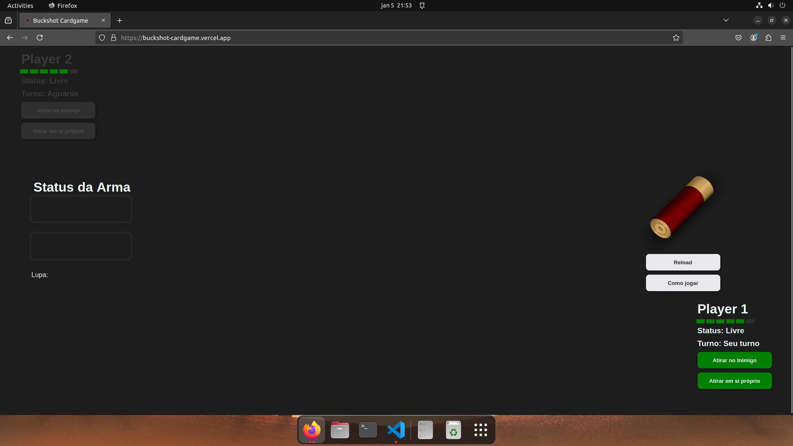

# Buckshot - The Card Game

Eu estava jogando **Buckshot Roulette** e fiquei muito atraída pela mecância do jogo. Então pensei em como ficaria se fosse um card game para jogar com um amigo. A princípio pensei no funcionamento com cartas de **Uno** e então transportei a mecância para código.

# O jogo original

**Buckshot Roulette** é um jogo indie bizarro que vi alguns streamers jogando e me despertou muito interesse pela estética. Ele é meio PSX, e isso define bem também na estética dentro do jogo, tentando transportar para essa época. No jogo você joga roleta russa contra um demônio e segue algumas regras muito bem estabelecidas, e isso que me atraiu para desenvolver esse card game. Atualmente o jogo já passou por uma atualização com modo multiplayer, mas poder jogar com outra pessoa também foi um dos motivos para eu pensar nesse projeto.

/i.s3.glbimg.com/v1/AUTH_08fbf48bc0524877943fe86e43087e7a/internal_photos/bs/2024/j/L/ffDYh9TEKyILDNPbmpTg/imagem-2024-10-30-184315429.png)

Caso queiram apoiar o jogo, [aqui o link dele na steam](https://store.steampowered.com/app/2835570/Buckshot_Roulette/).

# Mecânica

O jogo se baseia em uma roleta russa contra uma figura bizarra.
Assim que começa o jogo ele recarrega uma escopeta.

## Escopeta

Ela pode ter até 8 cartuchos, alguns vazios e alguns cheios. A quantidade de cartuchos é aleatória assim como a quantidade de cada tipo de cartucho. Na sequência o player terá a chance de escolher atirar no rival ou em si próprio.

#### Atirando em si
Se o cartucho estiver vazio, você ganha mais uma chance de escolher. Caso esteja cheio, você perde 1 de vida e o turno é passado.

#### Atirando no rival
Se o cartucho estiver cheio, o rival recebe o dano. Caso contrário, o turno é passado.

## Itens

#### Cerveja
Descarta a próxima bala e você pode ver qual seria.

#### Lupa
Semelhante ao item anterior, permite ver a próxima bala, mas sem descartá-la, permitindo com que decida o que fazer com essa bala.

#### Cigarro
Te dá +1 de vida (São as regras do jogo)

#### Algema 
Impede o rival de jogar o próximo turno.

#### Canivete
A próxima bala dá 2 de dano, independente em quem for atirar.

# O projeto
Esse projeto é desenvolvido em React e se comporta como um card game.

Os itens ficam na parte inferior ou superior, dependendo de qual player você for, ao lado do display com seus status como vida, se está livre ou algemado, se é o seu turno e os botões de decisão.

No campo do meio temos à esquerda os status da arma (quantos cartuchos vazios e cheios restam) e a dica caso algum dos players utilize a lupa. À direita vemos o último cartucho (seja descartado pela cerveja ou usado com a arma), o botão de Reload e de Instruções.

Você pode acessar a versão no ar para testes [nesse link](https://buckshot-cardgame.vercel.app/)
